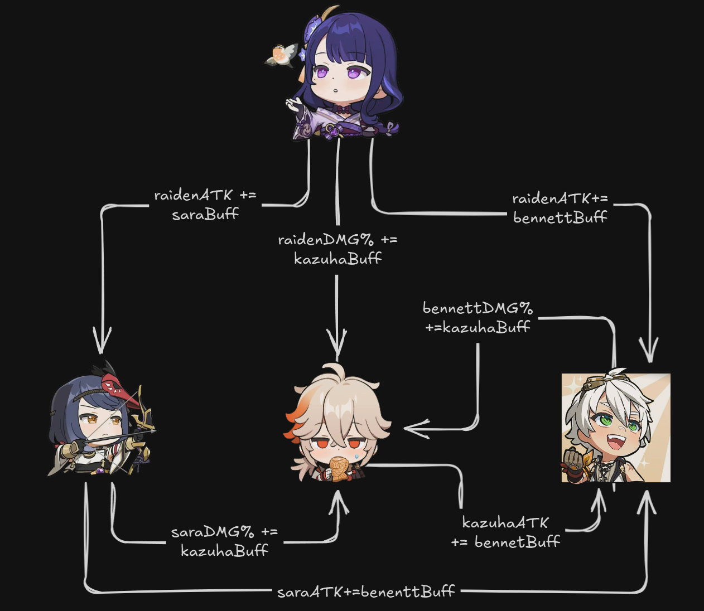

# Buff Dependency Problem

When calculating teamdps in genshin impact, characters are often buffed by other characters. this may be full uptime or only for certain attacks in a rotation.
Trying to model this in a dps calculator can be challenging, as we then need consider the order of building/computing stat tables and dependencies between stat tables in order to accurately compute damage.

## Assumptions

Let's consider a Raiden team composition with the following rotation:

```
Raiden E > Kazuha E > Sara E > Bennett Q > Kazuha Q > Sara Q > Raiden Q combo > Bennett E

let bennettBuff(self) => self.baseATK*132%
let kazuhaBuff(self) => self.EM*0.04%
let saraBuff(self) => self.baseATK*73.03%
```


## Problem Statement

When modeling stats and rotation operations for a Raiden team DPS calculation, we face two critical questions:

1. **What is the order of building/computing static stat tables for each character?**
2. **What is the order of computing damage based on dynamic buffs?**

### Issue

Stat tables should be built statically as a base before any damage calculation is done. However, stat tables for certain attacks may be "buffed" by other stat tables (with a given state), thus having to be computed dynamically/on the fly for that attack.

Here's where the complexity arises:

- **Raiden E** may be built statically
- **Raiden Q** dynamically depends on Bennett, Sara, and Kazuha being fully built to compute buffs accurately
- This requires Sara, Kazuha, and Bennett to be fully built first
- However, **Kazuha Q** depends on Sara and Bennett to be built to calculate his damage accurately
- But **Sara Q** and **Bennett Q** also depend on Kazuha being built to calculate their damage accurately

This creates an **acyclic graph** that may lead to either:
- Inaccurate buff evaluation leading to inaccurate results
- A deadlock/infinite recursion state

## Challenge

The buff dependency problem represents a fundamental challenge in game theory and optimization algorithms. It's not just about calculating damage numbers—it's about determining the correct order of operations when each operation depends on the results of others.