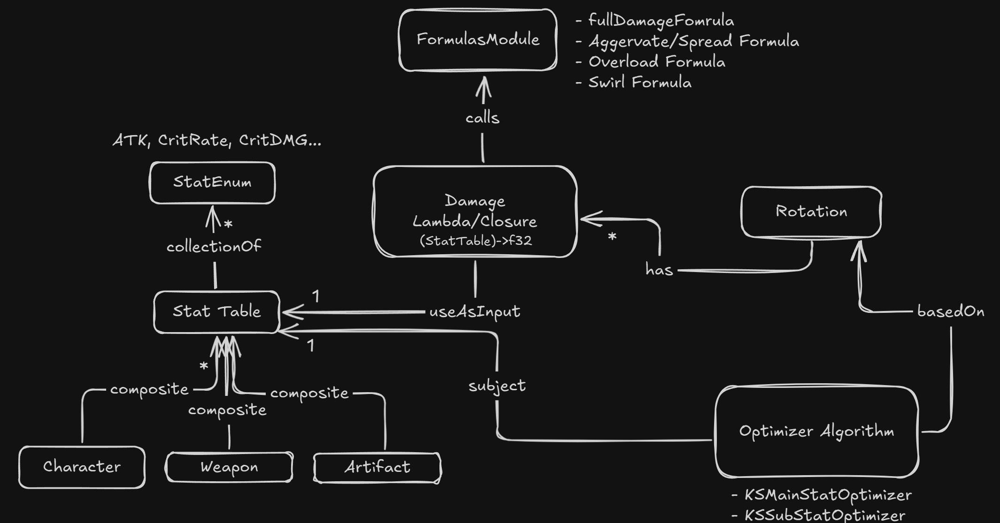

# Introduction

a genshin impact damage and stat calculation library.

```rust
use aminus::factories::*;
use aminus::model::stattable::*;
use aminus::model::rotation::*;
use aminus::model::stat::*;
use aminus::functions::dmg_function::*;
use aminus::functions::optimizers::*;

let ayaka = StatFactory::get_character_base_stats("ayaka").unwrap()
    .chain(Box::new(StatFactory::get_weapon_base_stats("mistsplitter").unwrap()))
    .chain(Box::new(StatTable::of(&[ //snapshot buffs
        (Stat::ATKPercent, 0.88),
        (Stat::CritRate, 0.55),
        (Stat::CryoDMGBonus, 0.73),
        (Stat::NormalATKDMGBonus, 0.3),
        (Stat::ChargeATKDMGBonus, 0.3),
        (Stat::CryoResistanceReduction, 0.4),
    ])));
let rotation = Rotation::of(vec![
    default_cryo_na_formula("n1", &ayaka, 0.84, 3, None),
    default_cryo_na_formula("n2", &ayaka, 0.894, 2, None),
    default_cryo_na_formula("ca", &ayaka, 3.039, 2, None),
    default_cryo_e_formula("skill", &ayaka, 4.07, 2, None),
    default_cryo_q_formula("burstcuts", &ayaka, 1.91, 19, None),
    default_cryo_q_formula("burstexplosion", &ayaka, 2.86, 1, None),
]);
let ayaka = optimizers::optimal_kqmc_5_artifacts_stats(&StatTable::unbox(ayaka), &rotation, 1.30);
let dps = rotation.evaluate(&ayaka)/21.;
```


## Why use Aminus
 Aminus is a **programmatic** alternative to using spread-sheets for genshin impact metagaming and theorycrafting use cases. 

 You can use Aminus for any use-case where you want to model stats or calculate damage. Such as for doing teamdps calculations, gearing/upgrade (eg: weapon, artifact, constelation, talents) comparison, estimating energy-recharge requirements ect.

## Front End
 Aminus provides a set of **primatives** and **abstractions** for damage-stat calculation.

 

 ### Primatives
  **Attribute:**  
  enum that represents a stat type. 
  
  eg: FlatATK, ATK%, Crit-Rate, Dmg%

  **StatValue:**  
  a pair between an attribute and a given value
  
  eg: (CritRate, 60%)

  some entity (character, weapon artifact) may have crit rate as a stat attribute but a StatValue specifies *how much* of a attribute it has.

 **StatTable:**
 a collection/data structure of multiple stat to value mappings.
 
 eg: ((ATK%, 20%), (CritRate, 60%), (CritDMG, 120%))
 
 this can be used to model any in-game "stat table", from the representation of a character's total stats to total amount of stats given from a weapon or artifact piece


**Operation**

a computation that takes StatTable(s) and computes it to resulting StatTable or number

ops can unary: (StatTable)->StatTable, turnary: (StatTable,StatTable)->StatTable

most common use for operations is to apply some formula to a stattable to compute damage. or to merge 2 stat tables without mutation

**Rotation**

specififes a sequence of actions (normal attack, skill, burst) a character performs to deal damage.

a rotation is just a collection of (StatTable)->number operations where the StatTable represents a character's total stats used for this action while then number is the damage output of the action.

## Use for Rust
1. add to rust project
   ```bash
   cargo add aminus
   ```
2. use in your code
   ```rust
   use aminus::*;
   ```

## Use for Typescript
1. install from npm
   ```bash
   npm install aminus
   ```
2. use in your code
   ```typescript
   import { StatFactory, StatTable, Rotation, optimizers } from "aminus";
   ```
